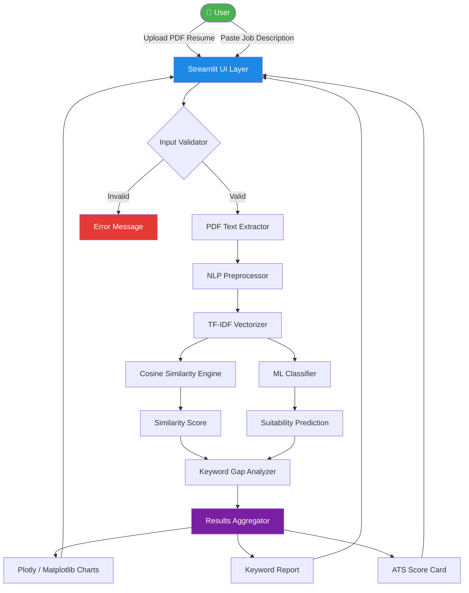

<div align="center">

# 🎯 AI Resume Analyzer

### *An Intelligent ATS-Powered Resume Screening & Job Matching System*

[](https://python.org)
[](https://streamlit.io)
[](https://scikit-learn.org)
[](LICENSE)
[](https://github.com/yourusername/ai-resume-analyzer/actions)
[](https://github.com/psf/black)

---

> *Bridging the gap between talented candidates and the right opportunities — powered by NLP and Machine Learning.*

</div>

---

## 📋 Table of Contents

- [Overview](#-overview)
- [Features](#-features)
- [Demo](#-demo)
- [Architecture](#-architecture)
- [Folder Structure](#-folder-structure)
- [Technology Stack](#-technology-stack)
- [ML Pipeline](#-machine-learning-pipeline)
- [Installation](#-installation)
- [Usage](#-usage)
- [Configuration](#-configuration)
- [Model Information](#-model-information)
- [Screenshots](#-screenshots)
- [Roadmap](#-roadmap)
- [Challenges](#-challenges)
- [Future Improvements](#-future-improvements)
- [Contributing](#-contributing)
- [License](#-license)
- [Author](#-author)

---

## 🌟 Overview

**AI Resume Analyzer** is a production-grade, AI-powered Applicant Tracking System (ATS) that intelligently evaluates resumes against job descriptions. Unlike naive keyword-matching tools, this system leverages NLP preprocessing, TF-IDF vector embeddings, cosine similarity scoring, and trained ML classifiers to provide deep, context-aware candidate assessment.

Whether you are a recruiter seeking to shortlist top candidates or a job seeker wanting to optimize your resume for ATS systems, this tool provides actionable insights backed by machine learning.

### 🎯 Problem Statement

Over **75% of resumes** are rejected by ATS before a human ever reads them — often due to poor keyword alignment, not lack of qualification. This project aims to:

1. Give candidates **real-time feedback** on resume-job alignment
2. Identify **missing keywords** that hurt ATS scores
3. Predict **suitability probability** using ML classifiers
4. Provide **explainable scoring** so candidates can take action

---

## ✨ Features

| Feature | Description |
|---|---|
| 📄 **PDF Parsing** | Extracts text from PDF resumes using PyPDF2 / pdfplumber |
| 🧹 **NLP Preprocessing** | Tokenization, stopword removal, lemmatization via NLTK |
| 📊 **TF-IDF Embeddings** | Vectorizes resume and JD text for semantic comparison |
| 🔢 **Cosine Similarity** | Quantifies how closely a resume matches the job description |
| 🤖 **ML Classification** | Predicts candidate suitability (Suitable / Not Suitable) |
| 🔍 **Keyword Gap Analysis** | Identifies keywords in the JD missing from the resume |
| 📈 **Visual Analytics** | Interactive charts via Plotly and Matplotlib |
| ⚙️ **Streamlit UI** | Clean, responsive, browser-based interface |
| 🔧 **Configurable** | YAML/ENV-based configuration for all parameters |
| 🧪 **Tested** | Pytest suite covering preprocessing, inference, and utilities |

---

## 🎬 Demo

> 🚧 **Live Demo:** *https://ai-ats-resume-analyzerr.streamlit.app/s*

```
📌 Placeholder: Add a GIF/screenshot of the application here.
    Example: 
```

To run locally, see [Installation](#-installation).

---

## 🏗️ Architecture



---

## 📁 Folder Structure

```
ai-resume-analyzer/
│
├── 📂 .github/
│   └── workflows/
│       └── python-ci.yml          # GitHub Actions CI pipeline
│
├── 📂 assets/
│   ├── images/                    # Static images for UI
│   ├── architecture/              # Architecture diagrams
│   └── demo/                      # Demo GIFs and screenshots
│
├── 📂 configs/
│   ├── config.yaml                # Main application configuration
│   └── logging.yaml               # Logging configuration
│
├── 📂 datasets/
│   ├── raw/                       # Raw, unprocessed data
│   ├── processed/                 # Cleaned and processed data
│   └── README.md                  # Dataset documentation
│
├── 📂 docs/
│   ├── Architecture.md
│   ├── System_Design.md
│   ├── Data_Pipeline.md
│   ├── Deployment.md
│   ├── Challenges.md
│   ├── Learnings.md
│   └── Future_Work.md
│
├── 📂 models/
│   ├── trained/                   # Serialized trained models (.joblib)
│   └── vectorizers/               # Saved TF-IDF vectorizers
│
├── 📂 notebooks/
│   └── *.ipynb                    # Jupyter exploration notebooks
│
├── 📂 scripts/
│   ├── train_model.py
│   ├── evaluate_model.py
│   └── download_dataset.py
│
├── 📂 src/
│   ├── app/                       # Streamlit UI layer
│   ├── preprocessing/             # NLP preprocessing pipeline
│   ├── feature_engineering/       # TF-IDF & feature extraction
│   ├── inference/                 # Model inference & scoring
│   ├── training/                  # Model training pipeline
│   ├── evaluation/                # Model evaluation utilities
│   └── utils/                     # Shared utility functions
│
├── 📂 tests/
│   ├── test_preprocessing.py
│   ├── test_inference.py
│   └── test_utils.py
│
├── .env.example
├── .gitignore
├── CHANGELOG.md
├── CODE_OF_CONDUCT.md
├── CONTRIBUTING.md
├── LICENSE
├── pyproject.toml
├── requirements.txt
└── README.md
```

---

## 🛠️ Technology Stack

| Category | Technology | Version | Purpose |
|---|---|---|---|
| **Language** | Python | 3.12 | Core language |
| **UI Framework** | Streamlit | 1.35+ | Web interface |
| **ML Framework** | scikit-learn | 1.5+ | TF-IDF, classifiers |
| **Data Processing** | Pandas | 2.2+ | Data manipulation |
| **Numerics** | NumPy | 1.26+ | Array operations |
| **NLP** | NLTK | 3.8+ | Text preprocessing |
| **PDF Parsing** | pdfplumber | 0.11+ | PDF text extraction |
| **PDF Parsing (alt)** | PyPDF2 | 3.0+ | PDF fallback parser |
| **Model Persistence** | Joblib | 1.4+ | Model serialization |
| **Visualization** | Plotly | 5.22+ | Interactive charts |
| **Visualization** | Matplotlib | 3.9+ | Static charts |
| **Config** | PyYAML | 6.0+ | Configuration files |
| **Testing** | Pytest | 8.2+ | Test framework |
| **Formatting** | Black | 24+ | Code formatter |
| **Linting** | Flake8 | 7.0+ | Code linter |

---

## 🔬 Machine Learning Pipeline

```
Raw PDF Resume
      │
      ▼
┌─────────────────┐
│  PDF Extraction  │  <- pdfplumber / PyPDF2
└────────┬────────┘
         │
         ▼
┌─────────────────┐
│ Text Cleaning   │  <- Remove special chars, normalize whitespace
└────────┬────────┘
         │
         ▼
┌─────────────────┐
│  Tokenization   │  <- NLTK word_tokenize
└────────┬────────┘
         │
         ▼
┌─────────────────┐
│ Stopword Removal│  <- NLTK english stopwords
└────────┬────────┘
         │
         ▼
┌─────────────────┐
│ Lemmatization   │  <- WordNetLemmatizer
└────────┬────────┘
         │
         ▼
┌─────────────────┐
│  TF-IDF         │  <- TfidfVectorizer (fitted on corpus)
│  Vectorization  │
└────────┬────────┘
         │
    ┌────┴─────┐
    ▼          ▼
Cosine      ML Classifier
Similarity  (LogisticRegression /
Score       RandomForest)
    │          │
    └────┬─────┘
         ▼
  Keyword Gap Analysis
         │
         ▼
   Results & Visualizations
```

---

## ⚙️ Installation

### Prerequisites

- Python 3.12+
- pip or conda
- Git

### Clone the Repository

```bash
git clone https://github.com/yourusername/ai-resume-analyzer.git
cd ai-resume-analyzer
```

### Create a Virtual Environment

```bash
# Using venv
python -m venv .venv
source .venv/bin/activate        # Linux/macOS
.venv\Scripts\activate           # Windows

# OR using conda
conda create -n resume-analyzer python=3.12
conda activate resume-analyzer
```

### Install Dependencies

```bash
pip install -r requirements.txt
```

### Download NLTK Data

```bash
python -c "import nltk; nltk.download('punkt'); nltk.download('stopwords'); nltk.download('wordnet')"
```

### Set Up Environment Variables

```bash
cp .env.example .env
# Edit .env with your preferred settings
```

---

## 🚀 Usage

### Run the Streamlit Application

```bash
streamlit run src/app/main.py
```

The app will open in your browser at `http://localhost:8501`

### Train the ML Model

```bash
python scripts/train_model.py --config configs/config.yaml
```

### Evaluate the Model

```bash
python scripts/evaluate_model.py --model models/trained/classifier.joblib
```

### Run Tests

```bash
pytest tests/ -v --cov=src
```

---

## 🔧 Configuration

All configurable parameters are managed through `configs/config.yaml`:

```yaml
preprocessing:
  max_features: 5000
  ngram_range: [1, 2]
  min_df: 2

model:
  algorithm: "logistic_regression"
  threshold: 0.65

app:
  title: "AI Resume Analyzer"
  port: 8501
```

Environment-specific secrets go in `.env` (never committed to Git):

```env
LOG_LEVEL=INFO
MODEL_PATH=models/trained/classifier.joblib
```

---

## 🤖 Model Information

| Model | Algorithm | Use Case |
|---|---|---|
| **Similarity Engine** | TF-IDF + Cosine Similarity | Resume-JD matching score |
| **Suitability Classifier** | Logistic Regression | Binary classification (Suitable/Not) |
| **Keyword Extractor** | TF-IDF top-k features | Identifying important terms |

### Model Performance (Placeholder)

> ⚠️ *Metrics will be populated after training on a labeled dataset.*

| Metric | Score |
|---|---|
| Accuracy | TBD |
| Precision | TBD |
| Recall | TBD |
| F1 Score | TBD |
| AUC-ROC | TBD |

---

## 📸 Screenshots

```
📌 Placeholder: Add application screenshots here.

  
  
  
```

---

## 🗺️ Roadmap

- [x] Project scaffold and architecture design
- [x] PDF text extraction module
- [x] NLP preprocessing pipeline
- [x] TF-IDF vectorization and cosine similarity
- [x] Streamlit UI prototype
- [ ] Labeled dataset collection and annotation
- [ ] ML classifier training and evaluation
- [ ] Keyword gap analysis visualizations
- [ ] REST API layer (FastAPI)
- [ ] Docker containerization
- [ ] Cloud deployment (AWS / GCP / Azure)
- [ ] Multi-language resume support
- [ ] LLM-based semantic analysis (GPT / Gemini integration)
- [ ] Batch processing for enterprise use

---

## 🧗 Challenges

- **PDF Parsing Complexity**: Resumes come in wildly different formats, requiring robust fallback strategies.
- **Lack of Labeled Data**: Training a supervised classifier requires labeled resume-JD pairs.
- **Semantic Gap in TF-IDF**: TF-IDF is lexical, not semantic — misses paraphrased skills.
- **ATS Bias**: Real ATS systems vary widely, making universal simulation difficult.

See [docs/Challenges.md](docs/Challenges.md) for detailed discussion.

---

## 🔮 Future Improvements

- **Transformer Embeddings**: Replace TF-IDF with BERT/sentence-transformers
- **Named Entity Recognition**: Extract skills, degrees, and companies using spaCy NER
- **LLM Feedback**: Use GPT-4 / Gemini for natural-language improvement suggestions
- **Multi-format Support**: Handle DOCX, HTML, and LinkedIn PDF exports

See [docs/Future_Work.md](docs/Future_Work.md) for the full roadmap.

---

## 🤝 Contributing

Contributions are welcome! Please read [CONTRIBUTING.md](CONTRIBUTING.md) before submitting a pull request.

```bash
git checkout -b feature/your-feature-name
git commit -m "feat: add your feature description"
git push origin feature/your-feature-name
```

---

## 📄 License

This project is licensed under the **MIT License** — see the [LICENSE](LICENSE) file for details.

---

## 👤 Author

**Abhishek** *(replace with your full name)*

[](https://github.com/yourusername)
[](https://linkedin.com/in/yourprofile)
[](mailto:youremail@gmail.com)

---

<div align="center">

*Built with ❤️ and Python | Star ⭐ this repo if you find it useful!*

</div>
